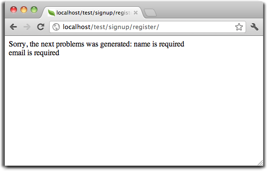

Урок 1: Рассмотрим на примере
=============================
В этом примере рассмотрим создание приложения с простой формой регистрации "с нуля".
Также рассмотрим основные аспекты поведения фреймворка. Если вам интересна автоматическая генерация кода, посмотрите :doc:`developer tools <tools>`.

Проверка установки
------------------
Будем считать что у вас уже установлено расширение Phalcon. Проверьте, есть ли в результатах phpinfo() секция "Phalcon" или выполните следующий код:

.. code-block:: php

    <?php print_r(get_loaded_extensions()); ?>

В результате вы должны увидеть Phalcon в списке:

.. code-block:: php

    Array
    (
        [0] => Core
        [1] => libxml
        [2] => filter
        [3] => SPL
        [4] => standard
        [5] => phalcon
        [6] => pdo_mysql
    )

Создание проекта
----------------
Лучше всего следовать данному руководсвту шаг за шагом. Полный код можно посмотреть `здесь <https://github.com/phalcon/tutorial>`_.

Структура каталогов
^^^^^^^^^^^^^^^^^^^
Phalcon не обязывает использовать определенную структуру каталогов. В виду слабой связанности фреймворка, вы можете использовать любую удобную структуру.

Для целей данного урока и для начала, мы предалгаем следующую структуру:

.. code-block:: php

    tutorial/
      app/
        controllers/
        models/
        views/
      public/
        css/
        img/
        js/

Обратите внимание на то, что вам не нужны директории с библиотеками, относящимися к фреймворку. Он полностью находится в памяти и все время готов к использованию.

"Красивые" ссылки (URLs)
^^^^^^^^^^^^^^^^^^^^^^^^
В этом примере будем использовать красивые УРЛ (ЧПУ). ЧПУ хороши как для SEO, так и лучше воспринимаются пользователем. Phalcon поддерживает rewrite-модули, 
представленные самыми распространенными веб-серверами. Вы не обязаны использовать ЧПУ в вашем приложении, вы можете с легкостью обойтись и без них.

В этом примере будем использовать rewrite модуль для Apache. Создадим несколько правил в файле /.htaccess:

.. code-block:: apacheconf

    #/.htaccess
    <IfModule mod_rewrite.c>
        RewriteEngine on
        RewriteRule  ^$ public/    [L]
        RewriteRule  (.*) public/$1 [L]
    </IfModule>

Все запросы будут перенаправлены в каталог public/ тем самым делая его корневым. Данный шаг обеспечивает закрытость внутренних файлов проекта от внешнего пользователя.

Следующий набор правил проверяет существует ли запрашиваемый файл, и если нет перенаправляет запрос index-файлу:

.. code-block:: apacheconf

    #/public/.htaccess
    <IfModule mod_rewrite.c>
        RewriteEngine On
        RewriteCond %{REQUEST_FILENAME} !-d
        RewriteCond %{REQUEST_FILENAME} !-f
        RewriteRule ^(.*)$ index.php?_url=/$1 [QSA,L]
    </IfModule>

Bootstrap
^^^^^^^^^
Это первый файл, который вам необходимо создать. Это основной файл приложения, предназначенный для управления всеми его аспектами. Здесь
вы можете реализовать как инициализацию компонентов приложения, так и его поведение.

Файл public/index.php содержит следующее:

.. code-block:: php

    <?php

    try {

        //Register an autoloader
        $loader = new \Phalcon\Loader();
        $loader->registerDirs(array(
            '../app/controllers/',
            '../app/models/'
        ))->register();

        //Create a DI
        $di = new Phalcon\DI\FactoryDefault();

        //Setting up the view component
        $di->set('view', function(){
            $view = new \Phalcon\Mvc\View();
            $view->setViewsDir('../app/views/');
            return $view;
        });

        //Handle the request
        $application = new \Phalcon\Mvc\Application();
        $application->setDI($di);
        echo $application->handle()->getContent();

    } catch(\Phalcon\Exception $e) {
         echo "PhalconException: ", $e->getMessage();
    }

Автозагрузка
^^^^^^^^^^^^
В первую очередь зарегистрируем автозагрузчик. Он будет использоваться для загрузки классов, таких как контроллеры и модели. Например мы можем
зарегистрировать одну или более директорий для контроллеров, увеличив гибкость приложения. В данном примере используется компонент Phalcon\\Loader.

С помощью него можно использовать разные стратегии загрузки классов, но в данном примере мы решили расположить классы в определенных директориях:

.. code-block:: php

    <?php

    $loader = new \Phalcon\Loader();
    $loader->registerDirs(
        array(
            '../app/controllers/',
            '../app/models/'
        )
    )->register();

Управление зависимостями
^^^^^^^^^^^^^^^^^^^^^^^^
Важная концепция, которую стоит понять при использовании Phalcon это :doc:`dependency injection <di>`.

DI представляет из себя глобальный контейнер для сервисов, необходимых нашему приложению. Каждый раз, когда фреймворку необходим какой-то компонент, он будет обращаться
за ним к контейнеру используя определенное имя компонента.
Так как Phalcon является слабосвязанным фреймворком, Phalcon\\DI выступает в роли клея, помогающего разным компонентам прозрачно взаимодействовать друг с другом.

.. code-block:: php

    <?php

    //Создание DI
    $di = new Phalcon\DI\FactoryDefault();

:doc:`Phalcon\\DI\\FactoryDefault <../api/Phalcon\_DI_FactoryDefault>` является вариантом Phalcon\\DI. Он берет на себя функции регистрации большинства компонентов из состава Phalcon, поэтому нам не придется регистрировать их вручную, один за другим.
В будущем нет никакой проблемы для замены этого сервиса своим.
На следующем шаге мы регистрируем сервис 'view', который указывает на папку с файлами 'view' (вьюхи). Т.к. данные файлы не относится к классам, они не могут быть подгружены автолоадером.
Существует несколько путей для регистрации сервисов, но в нашем примере мы используем анонимную функцию:

.. code-block:: php

    <?php

    //Setting up the view component
    $di->set('view', function(){
        $view = new \Phalcon\Mvc\View();
        $view->setViewsDir('../app/views/');
        return $view;
    });
На последнем этапе мы используем :doc:`Phalcon\\Mvc\\Application <../api/Phalcon_Mvc_Application>`.
Данная компонента служит для инициализации окружения входящих запросов, их перенаправления и обслуживания относящихся к ним действий. После отработки всех доступных действий, компонента возвращает полученные результаты.

.. code-block:: php

    <?php

    $application = new \Phalcon\Mvc\Application();
    $application->setDI($di);
    echo $application->handle()->getContent();

Как можно увидеть, файл инициализации очень короткий, нам нет необходимости подключать какие-либо дополнительные файлы. Таким образом, мы настроили гибкую структуру MVC-приложения менее чем за 30 строк кода.

Создание контроллеров
^^^^^^^^^^^^^^^^^^^^^
По умолчанию Phalcon будет искать контроллер с именем "Index". Как и во многих других фреймворках, он является исходной точкой, когда ни один другой контроллер или действие не были запрошены.
Наш контроллер по умолчанию (app/controllers/IndexController.php) выглядит так:

.. code-block:: php

    <?php

    class IndexController extends \Phalcon\Mvc\Controller
    {

        public function indexAction()
        {
            echo "<h1>Hello!</h1>";
        }

    }

Классы контроллеров должны заканчиваться на "Controller", чтобы автозагрузчик смог загрузить их, а их действия должны заканчиваться на "Action" по той же причине. Теперь можно открыть браузер и увидеть результат:

.. figure:: ../_static/img/tutorial-1.png
:align: center

Удача! Phalcon моментально отображает нашу простенькую страницу!

Отправка результатов для просмотра
^^^^^^^^^^^^^^^^^^^^^^^^^^^^^^^^^^

Отображение вывода напрямую из контроллера временами может быть хорошей идеей (например, когда нужно отослать JSON), но не всегда разумно, и сторонники шаблона MVC это подтвердят. Гораздо правильнее использовать отдельные файлы представлений.
Phalcon ищет файл представления с именем, совпадающим с именем действия внутри папки, совпадающей с именем последнего запущенного контроллера.
В нашем случае это будет выглядеть так (app/views/index/index.phtml):

.. code-block:: php

    <?php echo "<h1>Hello!</h1>";

В нашем контроллере (app/controllers/IndexController.php) теперь пустое определение действия:

.. code-block:: php

    <?php

    class IndexController extends \Phalcon\Mvc\Controller
    {

        public function indexAction()
        {

        }

    }

Вывод браузера останется прежним. Когда действие завершит свою работу, будет автоматически создан статический компонент :doc:`Phalcon\\Mvc\\View <../api/Phalcon_Mvc_View>`. Узнать больше оо представлениях можно :doc:`здесь <views>` .

Проектирование формы регистрации
^^^^^^^^^^^^^^^^^^^^^^^^^^^^^^^^

Давайте теперь измением файл представления index.phtml, добавив ссылку на новый контроллер "signup". Идея проста - позволить пользователям регистрироваться в нашем приложении.

.. code-block:: php

    <?php

    echo "<h1>Hello!</h1>";

    echo Phalcon\Tag::linkTo("signup", "Sign Up Here!");

Сгенерированный код HTML будет выводить тэг "<a>", указывающий на наш новый контроллер:

.. code-block:: html

    <h1>Hello!</h1> <a href="/test/signup">Sign Up Here!</a>

Для генерации тэга мы воспользовались встроенный классом :doc:`\Phalcon\\Tag <../api/Phalcon_Tag>`. Это служебный класс, позволяющий конструировать HTML-разметку в Phalcon-подобном стиле. Более подробно можно :doc:`узнать здесь<tags>`.

.. figure:: ../_static/img/tutorial-2.png
	:align: center

Контроллер Signup сейчас очень похож на предыдущий контроллер (app/controllers/SignupController.php):

.. code-block:: php

    <?php

    class SignupController extends \Phalcon\Mvc\Controller
    {

        public function indexAction()
        {

        }

    }

Пустое действие index говорит нам о том, что будет использоваться одноименный файл представления с нашей формой для регистрации:

.. code-block:: html+php

    <?php use Phalcon\Tag; ?>

    <h2>Sign using this form</h2>

    <?php echo Tag::form("signup/register"); ?>

     

        <label for="name">Name</label>
        <?php echo Tag::textField("name") ?>
     

     

        <label for="name">E-Mail</label>
        <?php echo Tag::textField("email") ?>
     

     

        <?php echo Tag::submitButton("Register") ?>
     

    </form>

В браузере это будет выглядеть так:

.. figure:: ../_static/img/tutorial-3.png
	:align: center

Класс :doc:`Phalcon\\Tag <../api/Phalcon_Tag>` также содержит полезные методы для работы с формами.

Метод Phalcon\\Tag::form принимает единственный аргумент, например, относительный идентификатор контроллер/действие приложения.

При нажатии на кнопку "Send" можно увидеть исключение, вызванное фреймворком. Оно говорит нам о том, что отсутствует действие "register" нашего контроллера "signup":

    PhalconException: Action "register" was not found on controller "signup"

Не будем испытывать судьбу и реализуем данный метод:

.. code-block:: php

    <?php

    class SignupController extends \Phalcon\Mvc\Controller
    {

        public function indexAction()
        {

        }

        public function registerAction()
        {

        }

    }

Снова жмем на кнопку "Send" и видим пустую страницу. Поля name и email, введенные пользователем, должны сохраниться в базе данных.
Следуя традиции MVC, все взаимодействие с БД должно вестись через модели, получая таким образом чистый код в ООП-стиле.

Creating a Model
^^^^^^^^^^^^^^^^
Phalcon brings the first ORM for PHP entirely written in C-language. Instead of increasing the complexity of development, it simplifies it.

Before creating our first model, we need a database table to map it to. A simple table to store registered users can be defined like this:

.. code-block:: sql

    CREATE TABLE `users` (
      `id` int(10) unsigned NOT NULL AUTO_INCREMENT,
      `name` varchar(70) NOT NULL,
      `email` varchar(70) NOT NULL,
      PRIMARY KEY (`id`)
    );

A model should be located in the app/models directory. The model mapping to "users" table:

.. code-block:: php

    <?php

    class Users extends \Phalcon\Mvc\Model
    {

    }

Setting a Database Connection
^^^^^^^^^^^^^^^^^^^^^^^^^^^^^
In order to be able to use a database connection and subsequently access data through our models, we need to specify it in our bootstrap process.
A database connection is just another service that our application has that can be use for several components:

.. code-block:: php

    <?php

    try {

        //Register an autoloader
        $loader = new \Phalcon\Loader();
        $loader->registerDirs(array(
            '../app/controllers/',
            '../app/models/'
        ))->register();

        //Create a DI
        $di = new Phalcon\DI\FactoryDefault();

        //Set the database service
        $di->set('db', function(){
            return new \Phalcon\Db\Adapter\Pdo\Mysql(array(
                "host" => "localhost",
                "username" => "root",
                "password" => "secret",
                "dbname" => "test_db"
            ));
        });

        //Setting up the view component
        $di->set('view', function(){
            $view = new \Phalcon\Mvc\View();
            $view->setViewsDir('../app/views/');
            return $view;
        });

        //Handle the request
        $application = new \Phalcon\Mvc\Application();
        $application->setDI($di);
        echo $application->handle()->getContent();

    } catch(\Phalcon\Exception $e) {
         echo "PhalconException: ", $e->getMessage();
    }

With the correct database parameters, our models are ready to work and interact with the rest of the application.

Storing data using models
^^^^^^^^^^^^^^^^^^^^^^^^^
Receiving data from the form and storing them in the table is the next step.

.. code-block:: php

    <?php

    class SignupController extends \Phalcon\Mvc\Controller
    {

        public function indexAction()
        {

        }

        public function registerAction()
        {

            $user = new Users();

            //Store and check for errors
            if ($user->save($_POST, array('name', 'email')) == true) {
                echo "Thanks for register!";
            } else {
                echo "Sorry, the following problems were generated: ";
                foreach ($user->getMessages() as $message) {
                    echo $message->getMessage(), " ";
                }
            }
        }

    }

We then instantiate the Users class, which corresponds to a User record. The class public properties map to the fields
of the record in the users table. Setting the relevant values in the new record and calling save()
will store the data in the database for that record. The save() method returns a boolean value which
informs us on whether the storing of the data was successful or not.

The ORM automatically escapes the input preventing SQL injections so we only need to pass the request to the method save().

Additional validation happens automatically on fields that are not null (required). If we don't type any of the
required files our screen will look like this:

Conclusion
----------
This is a very simple tutorial and as you can see, it's easy to start building an application using Phalcon.
The fact that Phalcon is an extension on your web server has not interfered with the ease of development or
features available. We invite you to continue reading the manual so that you can discover additional features offered by Phalcon!

Sample Applications
-------------------
The following Phalcon powered applications are also available, providing more complete examples:

* `INVO application`_: Invoice generation application. Allows for management of products, companies, product types. etc.
* `PHP Alternative website`_: Multilingual and advanced routing application
* `Album O'Rama`_: A showcase of music albums, handling big sets of data with :doc:`PHQL <phql>` and using :doc:`Volt <volt>` as template engine
* `Phosphorum`_: A simple and clean forum

.. _INVO application: http://blog.phalconphp.com/post/20928554661/invo-a-sample-application
.. _PHP Alternative website: http://blog.phalconphp.com/post/24622423072/sample-application-php-alternative-site
.. _Album O'Rama: http://blog.phalconphp.com/post/37515965262/sample-application-album-orama
.. _Phosphorum: http://blog.phalconphp.com/post/41461000213/phosphorum-the-phalcons-forum

